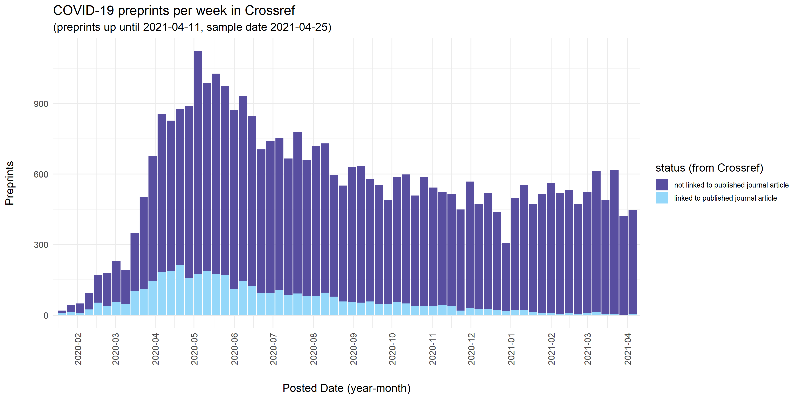
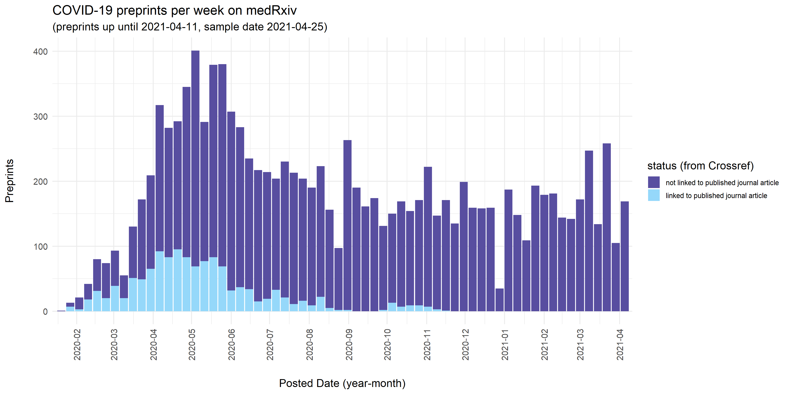
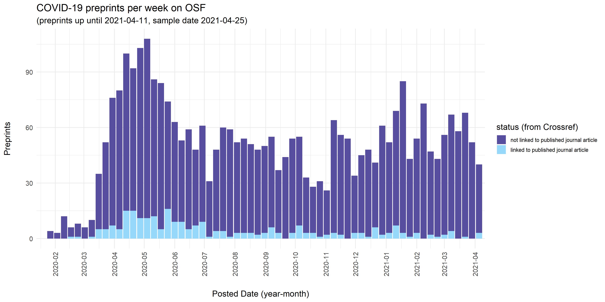
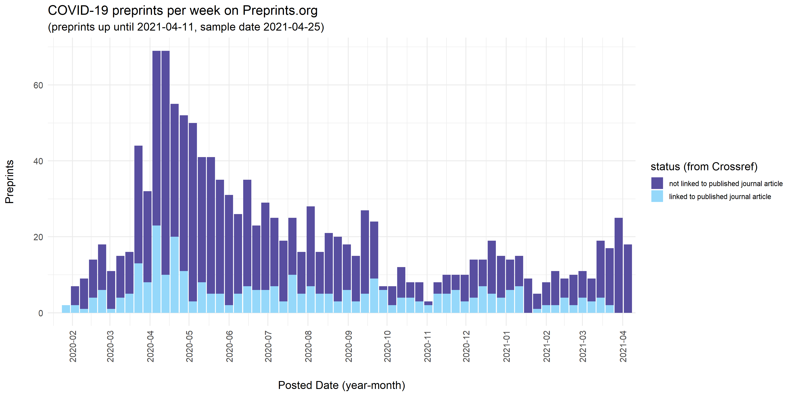

# COVID-19 preprints linked to published journal articles (based on Crossref metadata)

*[work in progress]*

This repository contains code used to extract details of the COVID-19 related preprints that are linked to published journal articles, and visualize their distribution over time (building on [COVID-19 Preprints](https://github.com/nicholasmfraser/covid19_preprints) by [Nicholas Fraser](https://orcid.org/0000-0002-7582-6339) and [Bianca Kramer](https://orcid.org/0000-0002-5965-6560))

The process for collecting preprint metadata is documented fully [here](covid19_preprints_published.Rmd). In general terms, preprint metadata harvested from Crossref were enriched with data on linked published journal articles using the metadata field `relation.is-preprint-of` in Crossref.  

### A note on coverage
The coverage of links to published articles in Crossref is **expected to be incomplete** - not all preprint servers include such links in their metadata, and those that do might do so with a time delay and might miss cases where preprints are subsequently published as journal articles. 

Crossref notifies preprint servers of potential matches with published articles. It requires preprint servers to verify the links and add them to the metadata record of the preprint. 
(see [Crossref metadata: Posted content (includes preprints)](https://support.crossref.org/hc/en-us/articles/213126346-Posted-content-includes-preprints#assoc)), but uptake of this varies across preprint services.

For example, SRRN (n=3772 COVID19-related preprints), Authorea (n=894), and Scielo Preprints (n=236) all do not include links to published papers in their preprint metadata on Crossref. Figshare [only recently](https://twitter.com/figshare/status/1277516684358803461) started depositing these metadata for their preprint servers that use Crossref (ChemRXiv, TechRXiv). Both [bioRxiv](https://www.biorxiv.org/about/FAQ) and [medRxiv](https://www.medrxiv.org/about/FAQ), that do update Crossref metadata with links to published papers, mention in their FAQs that there is usually a delay of a couple of weeks, and matches might be missed. 

In short, the proportions shown here represent the **lower bound of preprints that have subsequently been published as journal articles**, and as such, are as much a **reflection on the uptake of metadata linking** as on the actual rate of preprints that get published as journal articles.

### Results
Overall, the rate of preprints with a links to published paper in their metadata is low,  as  

Among the preprint servers that do include links to published papers in their metadata, there are interesting differences in the proportion of preprints linked to published papers, with percentages ranging from  (Figures 2, 3). These could reflect both technical workflows (e.g. linking  might be easier/quicker when preprint server and journals are from the same publisher) and publication practices (e.g. selectivity of journals, speed of peer review processes, decisions on when to post a preprint).

To investigate this further, we looked at a) links to published papers displayed on the preprint platform itself, compared to information in Crossref metadata (for medRXiv and bioRXiv), b) time to publication for preprints from different preprint servers, and c) the destination of preprints that get subsequently published, in relation to the preprint server they were posted on. 

(results to be added)

-----------------------------------------------------------------------------------------------

Preprints linked to published papers | medRxiv (n=7370)
:--------------------------|:----------------------------|
 | 

ResearchSquare (n=3794) | bioRxiv (n=2167)
:--------------------------|:----------------------------|
 |  

OSF preprint servers (n=1880) | JMIR Preprints (n=1083) 
:--------------------------|:----------------------------|
 | 

Preprints.org (n=990) | ChemRxiv (n=415)
:--------------------------|:----------------------------|
 | 

medRxiv (n=7370) | bioRxiv (n=2167)
:--------------------------|:----------------------------|
 | 

. | Destination of preprints linked to published papers (n=1348)|.
:----------------------------|:----------------------------|:--------------------------|
 |  | 

