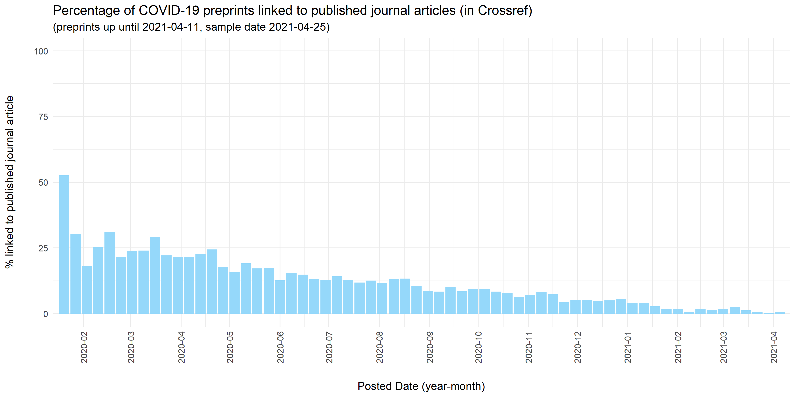
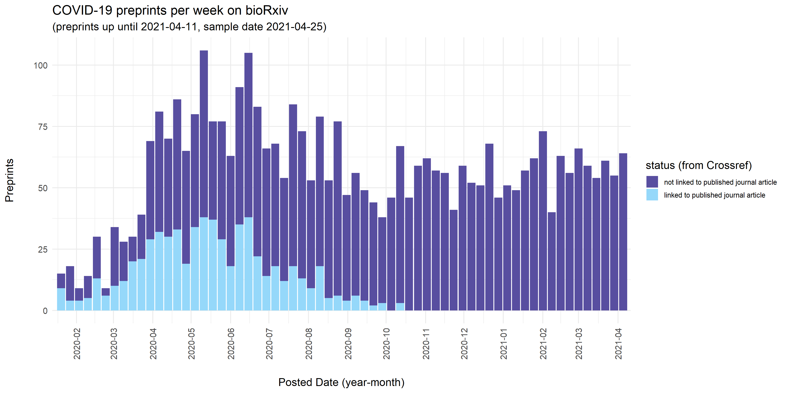
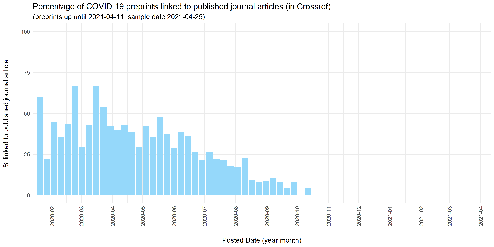
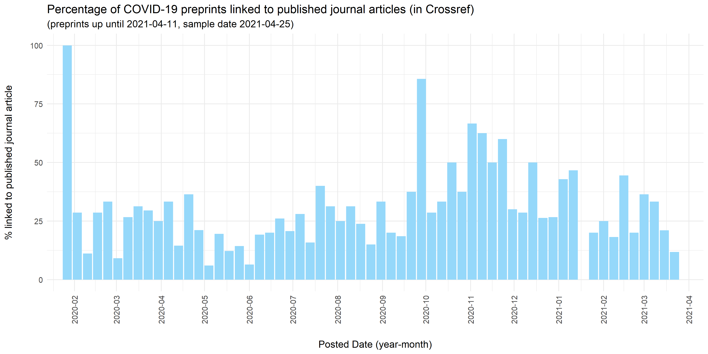
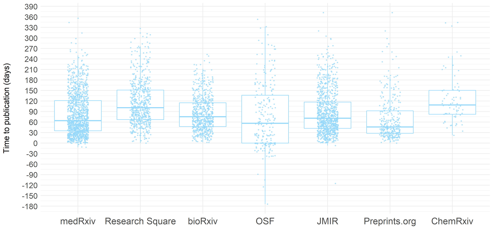
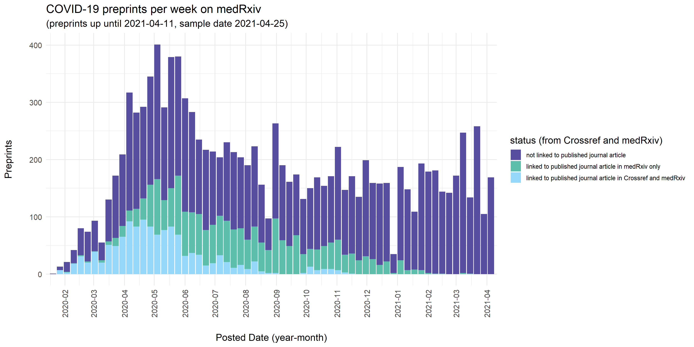
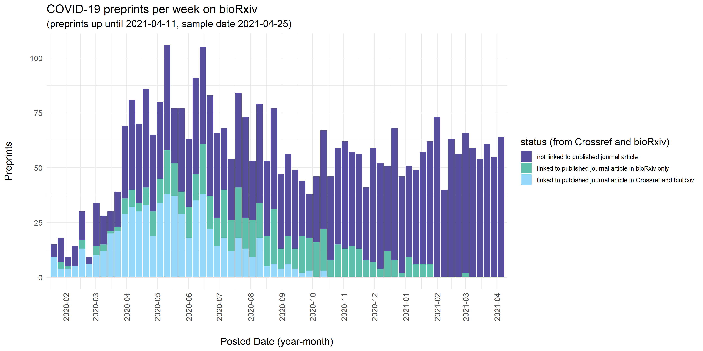

# COVID-19 preprints linked to published journal articles in Crossref metadata

This repository contains code used to extract details of COVID-19 related preprints that are linked to published journal articles in Crossref metadata, and visualize their distribution over time (building on [COVID-19 Preprints](https://github.com/nicholasmfraser/covid19_preprints))

The process for collecting preprint metadata is documented fully [here](01_covid19_preprints_published.Rmd). In general terms, preprint metadata harvested from Crossref were enriched with data on linked published journal articles using the metadata field `relation.is-preprint-of` in Crossref. Additionally, information was collected on time between preprint publication and publication of Data were collected on April 25, 2021 for COVID-related preprints published between January 1, 2020 and April  11, 2021.

### A note on coverage
The coverage of links to published articles in Crossref is **expected to be incomplete** - not all preprint servers include such links in their metadata, and those that do might do so with a time delay and might miss cases where preprints are subsequently published as journal articles. 

Crossref notifies preprint servers of potential matches with published articles. It requires preprint servers to verify the links and add them to the metadata record of the preprint. 
(see [Crossref metadata: Posted content (includes preprints)](https://support.crossref.org/hc/en-us/articles/213126346-Posted-content-includes-preprints#assoc)), but uptake of this varies across preprint services.

For example, SRRN (n=5862 COVID19-related preprints in this dataset), Authorea (n=1356), and Scielo Preprints (n=312) all do not include links to published papers in their metadata on Crossref. Figshare [only recently](https://twitter.com/figshare/status/1277516684358803461) started depositing these metadata for their preprint servers that use Crossref (ChemRXiv, TechRXiv). Both [bioRxiv](https://www.biorxiv.org/about/FAQ) and [medRxiv](https://www.medrxiv.org/about/FAQ), that do update Crossref metadata with links to published papers, mention in their FAQs that there is usually a delay of a couple of weeks, and matches might be missed. 

In short, the proportions shown here represent the **lower bound of preprints that have subsequently been published as journal articles**, and as such, are as much a **reflection on the uptake of metadata linking** as on the actual rate of preprints that get published as journal articles.

### Results

Overall, the rate of COVID19-related preprints with links to published papers in Crossref metadata is only 11% (4146 of 36541 preprints with Crossref DOI). However, as explained above, a number of preprint servers do not add these links to the metadata of their preprints at all, and for those that do the coverage may be incomplete and/or delayed.

Preprints linked to published papers (absolute numbers) | Preprints linked to published papers (percentage)
:--------------------------|:----------------------------|
 | 

Among the preprint servers that do include links to published papers in their metadata, there are interesting differences in the proportion of preprints linked to published papers, with percentages ranging from 8% (for OSF) to 51% (for JMIR). These could reflect both technical workflows (e.g. linking  might be easier/quicker when preprint server and journals are from the same publisher) and publication practices (e.g. selectivity of journals, speed of peer review processes, decisions on when to post a preprint).

medRxiv (n=11713) - absolute numbers | medRxiv (n=11713) - percentages
:--------------------------|:----------------------------|
 | 

ResearchSquare (n=6223) - absolute numbers | ResearchSquare (n=6223) - percentages
:--------------------------|:----------------------------|
 | 

bioRxiv (n=3675) - absolute numbers | bioRxiv (n=3675) - percentages
:--------------------------|:----------------------------|
  |  

OSF preprint servers (n=3272) - absolute numbers | OSF preprint servers (n=3272) - percentages
:--------------------------|:----------------------------|
 | 

JMIR Preprints (n=1865) - absolute numbers | JMIR Preprints (n=1865) - percentages
:--------------------------|:----------------------------|
 | 

Preprints.org (n=1314) - absolute numbers | Preprints.org (n=1314) - percentages
:--------------------------|:----------------------------|
 | 

ChemRxiv (n=523) - absolute numbers | ChemRxiv (n=523) - percentages
:--------------------------|:----------------------------|
 | 

. | Preprints linked to published papers - percentage per preprint server | .
:--------------------------|:--------------------------|:----------------------------|
 |  | 

#### Time to publication

One of the factors that will affect the proportion of preprints with links to journal publication at any given time is the time between preprint publication and publication of the subsequent journal article  ('time to publication') - a shorter time to publication would contribute to a higher number of preprints with links to published papers. For preprints in this sample with a link to a subsequent journal article, the average time to publication is 87 days (close to 3 months). There is no clear difference between preprint servers in time to publication - preprint servers with a relatively high proportion of preprints with a link to a published paper (esp. JMIR) do not have a shorter average time to publication. 

OSF shows the largest spread in time to publication, which could be due to the variety of preprint servers using the OSF platform, with corresponding differences in publication cultures including (timing of) preprint sharing. 

NB Note that time to publication can also be negative, reflecting cases where the preprint is shared *after* publication of the journal article.  

#### But there's more

As mentioned above, the coverage of links to published articles in Crossref is expected to be incomplete, even for preprint servers that do supply such links - either because of time delay in updating metadata, or because preprint servers might miss cases where preprints are subsequently published as journal articles. To check whether preprint servers update their preprints' metadata for all published articles they are aware of, links to published papers displayed on the preprint platform itself were compared to information in Crossref metadata. This was done for bioRxiv and medRxiv, using scripts from [https://github.com/preprinting-a-pandemic/pandemic_preprints](https://github.com/preprinting-a-pandemic/pandemic_preprints). 

As shown in the charts below, both bioRxiv and medRxiv have more extensive coverage of published articles on their platform itself than recorded in their preprints' metadata: 28.7% vs. 10.8% for medRxiv and 32.7.% vs. 17.3% for bioRxiv, for COVID19-related preprints in this sample (there were no cases of preprints with only a link to a published paper in the metadata, but not on the preprint platform). The delay in updating this information in metadata points to the **potential for much more accurate and complete coverage of links to published papers in metadata of preprints**. 

Interestingly, both for bioRxiv and medRxiv, time to publication is longer for preprints with links to published papers that are only shown on the platform itself, compared to preprints with links to published papers in Crossref metadata. 

For an estimation of how many published journal  articles are not detected by the preprint servers themselves, a [recent analysis](https://doi.org/10.1101/2020.09.04.20188771) by Francois Lachapelle, shared as preprint in medRxiv, showed that in September 2020, up to 24.8% (biorXiv) and 19.3% (medRxiv) COVID19-related preprints could be matched to published journal articles in the CORD-19 database, using conditional fuzzy logic. A recent article by [Cabanac et al.] (https://doi.org/10.1007/s11192-021-03900-7) tested a preprint-publication linker based on title and author information in Crossref. The used a test set, evaluated in October 2020, of 343 COVID19-related preprints, 323 of which on medRXiv. They reported manual confirmation of corresponding published journal articles for 121 of these (35.3%). Of these, only 48 were detected by the preprint server itself, while the algorithm developed detected 110, with an additional 18 false positives.   

Other potential avenues for data on links between preprints and published papers to explore could be [EuropePMC](https://europepmc.org/Preprints) (that links preprints and published papers), [Unpaywall](https://unpaywall.org/data-format) (that includes preprints as green OA versions of published papers) and [Microsoft Academic](https://docs.microsoft.com/en-us/academic-services/graph/resources-faq#what-is-familyid-in-papers) (that groups detected versions of a paper in a 'paper family').  

medRxiv (n=11713) | bioRxiv (n=3675)
:--------------------------|:----------------------------|
 | 

Preprints linked to published papers | Time to publication
:--------------------------|:----------------------------|
 | 

#### Preprint destination

Some preprint servers (e.g. bioRxiv, medRxiv, OSF-preprint servers) are publisher-independent, while others (e.g. JMIR, ResearchSquare and Preprints.org) are directly associated with specific publishers (JMIR, SpringerNature and MDPI, respectively). While open to other preprints, these preprint servers offer authors submitting to (some of) their journals the option to share their paper on the preprint server associated with the publisher during the peer review process (JMIR, SprongerNature), or notify submitting authors of the existence of the publisher's preprint server (MDPI). 

It might be expected that linking preprints and published papers might be easier/quicker when preprint server and journals are associated with the same publisher, and indeed, JMIR, and to a lesser extent Preprints.org and ResearchSquare, have the highest proportion of preprints linked to published papers in the sample studied here.

To check whether published papers from publisher-associated preprint servers indeed end up in journals from the same publisher, an alluvial plot was made showing the destination of all preprints with links to a published paper in their metadata. Indeed, preprints from JMIR and ResearchSquare predominantly 'end up ' in journals from JMIR and SpringerNature, respectively. However, only a subset of preprints on Preprints.org with a link to a subsequent paper get published in MDPI-journals, with over half ending up in journals from other publishers. 

. | Destination of preprints linked to published papers (n=4146)|.
:----------------------------|:----------------------------|:--------------------------|
 |  | 

### Post scriptum: The Case of the Disappearing Metadata

When comparing data collected from October 2020 to April 2021, (older data in directory [archived](archived)), it appears that a sizeable number of COVID-related preprints on medRxiv (but not on bioRxiv) **lose (and sometimes gain back) the link to the published paper in Crossref metadata** (while still displaying a link on medRxiv itself). This may be a technical issue occurring with metadata updates. It seems important to investigate this further, as it has implications for the use of these metadata. 

medRxiv, sample date Oct 24, 2020 | bioRxiv, sample date Oct 24, 2020 
:--------------------------|:----------------------------|
 | 

medRxiv, sample date Nove 27, 2020 | bioRxiv, sample date Nov 27, 2020 
:--------------------------|:----------------------------|
 | 

medRxiv, sample date Dec 18, 2020 | bioRxiv, sample date Dec 18, 2021 
:--------------------------|:----------------------------|
 | 

medRxiv, sample date Jan 24, 2021 | bioRxiv, sample date Jan 24, 2021 
:--------------------------|:----------------------------|
 | 

medRxiv, sample date Apr 25, 2021 | bioRxiv, sample date Apr 25, 2021
:--------------------------|:----------------------------|
 | ![COVID-19 preprints per week - medRxiv]
