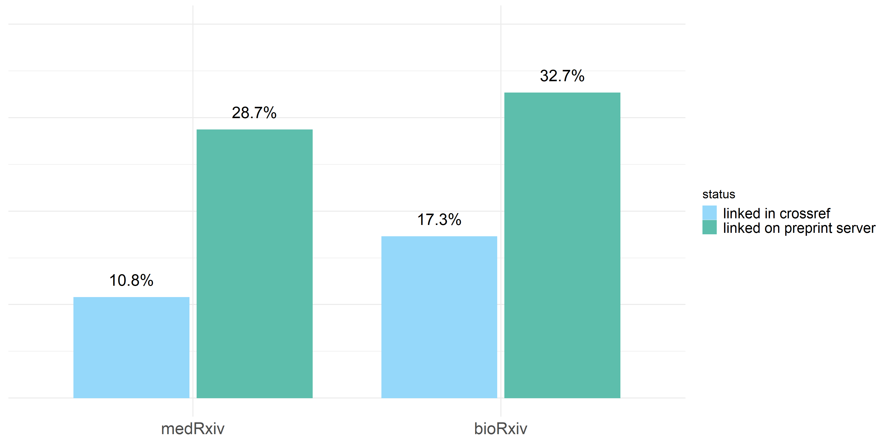
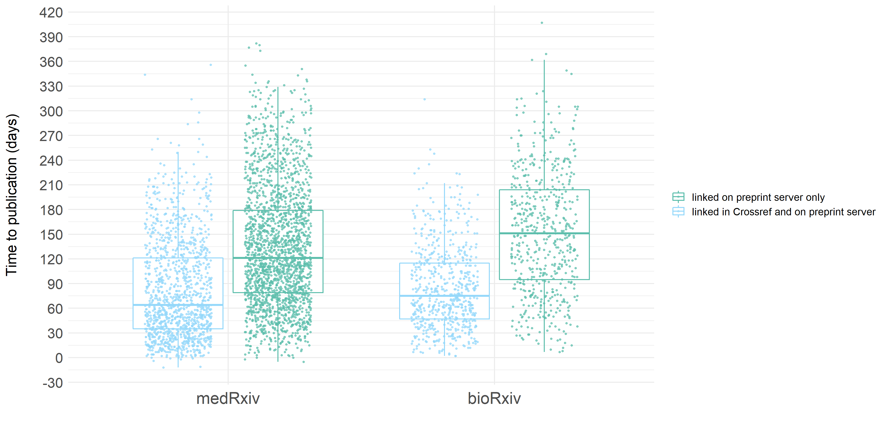

# COVID-19 preprints linked to published journal articles - as reflected in Crossref metadata

*[work in progress]*

This repository contains code used to extract details of the COVID-19 related preprints that are linked to published journal articles, and visualize their distribution over time (building on [COVID-19 Preprints](https://github.com/nicholasmfraser/covid19_preprints) by [Nicholas Fraser](https://orcid.org/0000-0002-7582-6339) and [Bianca Kramer](https://orcid.org/0000-0002-5965-6560))

The process for collecting preprint metadata is documented fully [here](covid19_preprints_published.Rmd). In general terms, preprint metadata harvested from Crossref were enriched with data on linked published journal articles using the metadata field `relation.is-preprint-of` in Crossref. Additionally, information was collected on time between preprint publication and publication of Data were collected on October 24, 2020 for COVID-related preprints published between January 1, 2020 and October 11, 2020.

### A note on coverage
The coverage of links to published articles in Crossref is **expected to be incomplete** - not all preprint servers include such links in their metadata, and those that do might do so with a time delay and might miss cases where preprints are subsequently published as journal articles. 

Crossref notifies preprint servers of potential matches with published articles. It requires preprint servers to verify the links and add them to the metadata record of the preprint. 
(see [Crossref metadata: Posted content (includes preprints)](https://support.crossref.org/hc/en-us/articles/213126346-Posted-content-includes-preprints#assoc)), but uptake of this varies across preprint services.

For example, SRRN (n=3772 COVID19-related preprints), Authorea (n=894), and Scielo Preprints (n=236) all do not include links to published papers in their preprint metadata on Crossref. Figshare [only recently](https://twitter.com/figshare/status/1277516684358803461) started depositing these metadata for their preprint servers that use Crossref (ChemRXiv, TechRXiv). Both [bioRxiv](https://www.biorxiv.org/about/FAQ) and [medRxiv](https://www.medrxiv.org/about/FAQ), that do update Crossref metadata with links to published papers, mention in their FAQs that there is usually a delay of a couple of weeks, and matches might be missed. 

In short, the proportions shown here represent the **lower bound of preprints that have subsequently been published as journal articles**, and as such, are as much a **reflection on the uptake of metadata linking** as on the actual rate of preprints that get published as journal articles.

### Results

Overall, the rate of COVID19-related preprints with links to published papers in their metadata is only 6% (1348 of 22905 preprints with Crossref DOI). However, as explained above, a number of preprint servers do not add these links to the metadata of their preprints at all, and for those that do the coverage may be incomplete and/or delayed.

Among the preprint servers that do include links to published papers in their metadata, there are interesting differences in the proportion of preprints linked to published papers, with percentages ranging from 3% (for medRxiv) to 38% (for JMIR). These could reflect both technical workflows (e.g. linking  might be easier/quicker when preprint server and journals are from the same publisher) and publication practices (e.g. selectivity of journals, speed of peer review processes, decisions on when to post a preprint).
 

Preprints linked to published papers | medRxiv (n=7370)
:--------------------------|:----------------------------|
 | 

ResearchSquare (n=3794) | bioRxiv (n=2167)
:--------------------------|:----------------------------|
 |  

OSF preprint servers (n=1880) | JMIR Preprints (n=1083) 
:--------------------------|:----------------------------|
 | 

Preprints.org (n=990) | ChemRxiv (n=415)
:--------------------------|:----------------------------|
 | 

#### Time to publication

One of the factors that will affect the proportion of preprints with links to journal publication at any given time is the time between preprint publication and publication of the subsequent journal article  ('time to publication') - a shorter time to publication would contribute to a higher number of preprints with links to published papers. For preprints in this sample with a link to a subsequent journal article, the average time to publication is 56 days (almost 2 months). There is no clear difference between preprint servers in time to publication - preprint servers with a relatively high proportion of preprints with a link to a published paper (esp. JMIR) do no have a shorter average time to publication. 

Interestingly, it is the preprint server with the lowest proportion of published journal articles (medRxiv) that has the shortest average time to publication (32 days). This could be related to efforts by a number of publishers of biomedical journals to [maximize the efficiency and speed of peer review for COVID19-related research](https://oaspa.org/covid-19-publishers-open-letter-of-intent-rapid-review/), or by author decisions on when to publish a preprint (prior to or directly upon submission, or further on in the peer review process).

OSF shows the largest spread in time to publication, which could be due to the variety of preprint servers using the OSF platform, with corresponding differences in publication cultures including (timing of) preprint sharing. 

#### But wait, there's more

As mentioned above, the coverage of links to published articles in Crossref is expected to be incomplete, even for preprint servers that do supply such links - either because of time delay in updating metadata, or because preprint servers might miss cases where preprints are subsequently published as journal articles. To check whether preprint servers update their preprints' metadata for all published articles they are aware of, links to published papers displayed on the preprint platform itself were compared to information in Crossref metadata. This was done for bioRxiv and medRxiv, using scripts from [https://github.com/preprinting-a-pandemic/pandemic_preprints](https://github.com/preprinting-a-pandemic/pandemic_preprints). 

As shown in the charts below, both bioRxiv and medRxiv have more extensive coverage of published articles on their platform itself than recorded in their preprints' metadata. The delay in updating this information in metadata records is most pronounced for medRxiv, and points to the potential for much more accurate and complete coverage of links to published papers in metadata of preprints, at least for bioRxiv and medRxiv. 

Interestingly, both for bioRxiv and medRxiv, time to publication is longer for preprints with links to published papers that are only shown on the platform itself, compared to preprints with links to published papers in Crossref metadata. 

medRxiv (n=7370) | bioRxiv (n=2167)
:--------------------------|:----------------------------|
 | 

Preprints linked to published papers | Time to publication
:--------------------------|:----------------------------|
 | 

. | Destination of preprints linked to published papers (n=1348)|.
:----------------------------|:----------------------------|:--------------------------|
 |  | 

